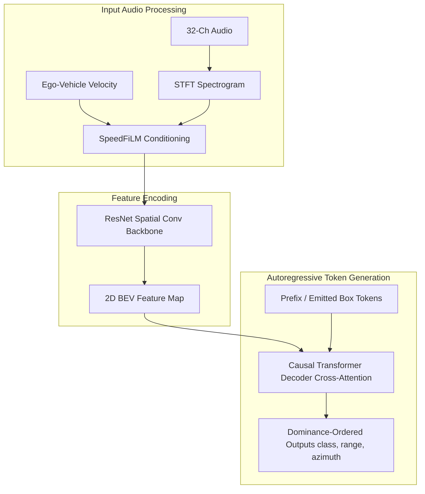

# SoundReg3D Repository Knowledge Base

This folder serves as the central documentation of all architectural knowledge, code structures, and mechanics found in the [SoundReg3D](file:///home/joadeola/Softwares/SoundReg3D) codebase.

---

## 1. Directory Structure & Key Files

The codebase is built on top of the **OpenPCDet** 3D object detection framework, heavily modified to support autoregressive sequence generation:

* **[autoreg3d/](file:///home/joadeola/Softwares/SoundReg3D/autoreg3d)**: Core source directory.
  * **[setup.py](file:///home/joadeola/Softwares/SoundReg3D/autoreg3d/setup.py)**: Installation script.
  * **[requirements.txt](file:///home/joadeola/Softwares/SoundReg3D/autoreg3d/requirements.txt)**: Python package dependencies.
  * **[pcdet/](file:///home/joadeola/Softwares/SoundReg3D/autoreg3d/pcdet)**: Source code library.
    * **`models/detectors/`**:
      * [autoreg3d.py](file:///home/joadeola/Softwares/SoundReg3D/autoreg3d/pcdet/models/detectors/autoreg3d.py): SFT (Supervised Fine-Tuning) detector.
      * [autoreg3d_rl.py](file:///home/joadeola/Softwares/SoundReg3D/autoreg3d/pcdet/models/detectors/autoreg3d_rl.py): GRPO RL (Group Relative Policy Optimization) detector.
    * **`models/dense_heads/`**:
      * [autoreg3d_head.py](file:///home/joadeola/Softwares/SoundReg3D/autoreg3d/pcdet/models/dense_heads/autoreg3d_head.py): GPT-2 decoder head implementing cross-attention, token generation, beam search, and sampling.
    * **`utils/`**:
      * [sequence_utils.py](file:///home/joadeola/Softwares/SoundReg3D/autoreg3d/pcdet/utils/sequence_utils.py): Tokenizes, quantizes, and detokenizes continuous 3D bounding box coordinates and categories.
      * [rl_utils.py](file:///home/joadeola/Softwares/SoundReg3D/autoreg3d/pcdet/utils/rl_utils.py): Contains reinforcement learning metrics and reward calculations.
  * **[tools/](file:///home/joadeola/Softwares/SoundReg3D/autoreg3d/tools)**: Runner scripts.
    * [train.py](file:///home/joadeola/Softwares/SoundReg3D/autoreg3d/tools/train.py): Main entrypoint for model training.
    * [test.py](file:///home/joadeola/Softwares/SoundReg3D/autoreg3d/tools/test.py): Evaluates the model checkpoints on target metrics.
    * [eval_cascade.py](file:///home/joadeola/Softwares/SoundReg3D/autoreg3d/tools/eval_cascade.py): Implements Cascading Refinement decoding.

---

## 2. Core Code Mechanics & Design

### 2.1 Box Tokenization & Quantization ([sequence_utils.py](file:///home/joadeola/Softwares/SoundReg3D/autoreg3d/pcdet/utils/sequence_utils.py))
Continuous 3D boxes are mapped to integer IDs using a class `SequenceTokenizer`.
* **Vocabulary Format**: Rather than a single shared vocabulary (like in text models), it uses independent sub-vocabularies for each dimension ($x$, $y$, $z$, $dx$, $dy$, $dz$, $\psi$, $v_x$, $v_y$).
* **Quantization Formula**: A value $v$ is normalized between its min and max bounds and rounded:
  $$\text{idx} = \text{round}\left( \frac{v - v_{\text{min}}}{v_{\text{max}} - v_{\text{min}}} \cdot (\text{vocab\_size} - 1) \right) + \text{token\_offset}$$
* **Class Placement**: Supports placing the class token first (`[cls, x, y, z, ...]`), last, or middle.

### 2.2 GPT-2 Cross-Attention Decoder ([autoreg3d_head.py](file:///home/joadeola/Softwares/SoundReg3D/autoreg3d/pcdet/models/dense_heads/autoreg3d_head.py))
Uses a Hugging Face `GPT2Model` configured with `add_cross_attention=True`.
* **Feature Integration**: 2D BEV features of shape $(B, H \times W, C)$ are passed as `encoder_hidden_states` to the decoder.
* **Relative Position Embeddings**: Decomposes 2D positional embeddings into sum of learned $x$-axis and $y$-axis parameters (`encoder_xpos_embed` and `encoder_ypos_embed`) to maintain spatial awareness with linear complexity.
* **Decoding Modes**: Supports `greedy`, `sample`, and `beam` (using Hugging Face's `BeamSearchScorer`).

### 2.3 SFT vs. RL Training Loop
* **`AutoReg3D`**: Supervised training using **Teacher Forcing**. It feeds ground-truth sequences shifted by one position, predicting the next token and calculating cross-entropy loss over all tokens.
* **`AutoReg3DRL`**: Reinforcement learning utilizing **GRPO**. It samples a group of $G$ generations per point cloud, computes a task-aligned F1 IoU reward for each generation, and uses group-relative advantage to compute the policy gradient loss:
  $$\mathcal{A}_{i,t} = \frac{\mathcal{R}_i - \mu_{\mathcal{R}}}{\sigma_{\mathcal{R}}}$$

---

## 3. Acoustic Integration Architecture (SoundReg)

To migrate the point-cloud detector to an acoustic-only bird's-eye view detector (merging with **AcousticBEV**), the following components are integrated:

### Key Integration Points
1. **Dominance-Ordered Generation**:
   * Instead of sorting boxes near-to-far (distance to ego vehicle), acoustic boxes are sorted descending by steered-response power (SRP) beamforming energy.
   * Emitting the loudest sources first allows the causal decoder to condition on them and reconstruct weaker, masked concurrent sources (mitigating time-frequency masking).
2. **Quantized Output Space**:
   * SoundReg limits the predicted coordinates to 2D BEV $(r, \theta)$ instead of full 3D boxes. Hence, the tokenizer vocabulary can shrink to 3 attributes: `[class, range, azimuth]`.
